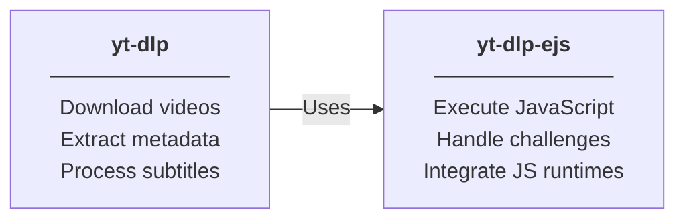

```mermaid
flowchart LR
    A["<b>yt-dlp</b><br/>────────────<br/>Download videos<br/>Extract metadata<br/>Process subtitles"]
    B["<b>yt-dlp-ejs</b><br/>────────────<br/>Execute JavaScript<br/>Handle challenges<br/>Integrate JS runtimes"]

    A -->|Uses| B

```
